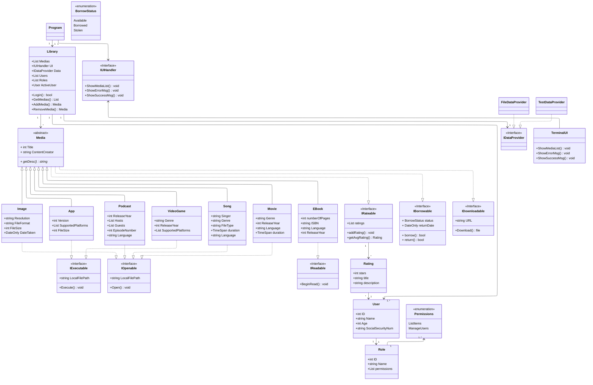

#UML Class diagram

```mermaid
---
config:
  layout: elk
---
classDiagram
    %% Program relations
    Program "1" --> "1" Library
    Program "1" --> IUIHandler 

    %% Libarary relations
    Library "1" --> "*" Media
    Library "1" --> "1..*" User
    Library "1" --> "1" IDataProvider

    %% Persistance layer relations
    FileDataProvider ..|> IDataProvider
    TestDataProvider ..|> IDataProvider

    
    %% User system
    Permissions "1..*" <-- "1" Role
    User "1" --> "1" Role
    IUIHandler <-- TerminalUI
    
    %% Media inheritance
    Media  <|-- Image
    Media  <|-- App
    Media  <|-- Podcast
    Media  <|-- VideoGame
    Media  <|-- Song
    Media  <|-- Movie
    Media  <|-- EBook

    %% Media relations
    Media ..|> IRateable
    Media ..|> IBorrowable
    Media ..|> IDownloadable

    %% Executable medias
    App ..|> IExecutable
    VideoGame ..|> IExecutable

    %% Openable medias
    Movie ..|> IOpenable
    Song ..|> IOpenable
    Podcast ..|> IOpenable
    Image ..|> IOpenable

    %% Readable medias
    EBook ..|> IReadable

    %% Intafaces relations
    IRateable "1" --> "*"Rating
    Rating "*" --> "1" User

    class Program {

    }
    
    %% ==========[ Domain Layer stuff ]==========%%

    class Library {
        +List<Media> Medias
        +IUIHandler UI
        +IDataProvider Data
        +List<User> Users
        +List<Role> Roles
        +User ActiveUser
        +Login() bool
        +GetMedias() List<Media>
        +AddMedia() Media
        +RemoveMedia() Media
        
    }


    class Media {
        <<abstract>>
        + int Title
        + string ContentCreator
        + getDesc()* string
    }
    class Image{
      +string Resolution
      +string FileFormat
      +int FileSize
      +DateOnly DateTaken
    }
    class App{
        +int Version
        +List<Platform> SupportedPlatforms
        +int FileSize
    }
    class Podcast {
      +int ReleaseYear
      +List<String> Hosts
      +List<String> Guests
      +int EpisodeNumber
      +string Language
    }
    class VideoGame {
      +string Genre
      +int ReleaseYear
      +List<Plaform> SupportedPlatforms
    }
    class Song  {
      +string Singer
      +string Genre
      +string FileType
      +TimeSpan duration
      +string Language
    }
    class Movie  {
        +string Genre
        +int ReleaseYear
        +string Language 
        +TimeSpan duration
    }
    class EBook  {
      +int numberOfPages
      +string ISBN
      +string Language
      +int ReleaseYear
    }
    class  IBorrowable  {
        <<Interface>>
        + BorrowStatus status
        + DateOnly returnDate
        + borrow() bool
        + return() bool
    }
    class  IRateable  {
        <<Interface>>
        +List<Rating> ratings
        +addRating() void
        +getAvgRating() Rating
    }
    class  IDownloadable  {
        <<Interface>>
        +string URL
        +Download() file
    }
    class  IOpenable {
        <<Interface>>
        +string LocalFilePath
        +Open() void
    }
    class  IExecutable  {
        <<Interface>>
        +string LocalFilePath
        +Execute() void
    }
    class IReadable {
        <<Interface>>
        +BeginRead() void
    }

    class Rating {
        +int stars
        +string title
        +string description
    }

    class Role {
        +int ID
        +string Name
        +List<Permissions> permissions
    }
    class User {
        +int ID
        +string Name
        +int Age
        +string SocialSecurityNum

    }


    class Permissions {
    <<enumeration>>
    ListItems
    ManageUsers
    }
    class BorrowStatus {
        <<enumeration>>
        Available
        Borrowed
        Stolen
    }


    %% ==========[ Presentation Layer stuff ]==========%%
    class IUIHandler {
        <<Interface>>
        +ShowMediaList() void
        +ShowErrorMsg() void
        +ShowSuccessMsg() void
    }
    class TerminalUI {
        +ShowMediaList() void
        +ShowErrorMsg() void
        +ShowSuccessMsg() void
    }


    %% ==========[ Persistance Layer stuff ]==========%%

    class IDataProvider{
        <<Interface>>
    }

    class FileDataProvider {

    }

    class TestDataProvider {

    }

```